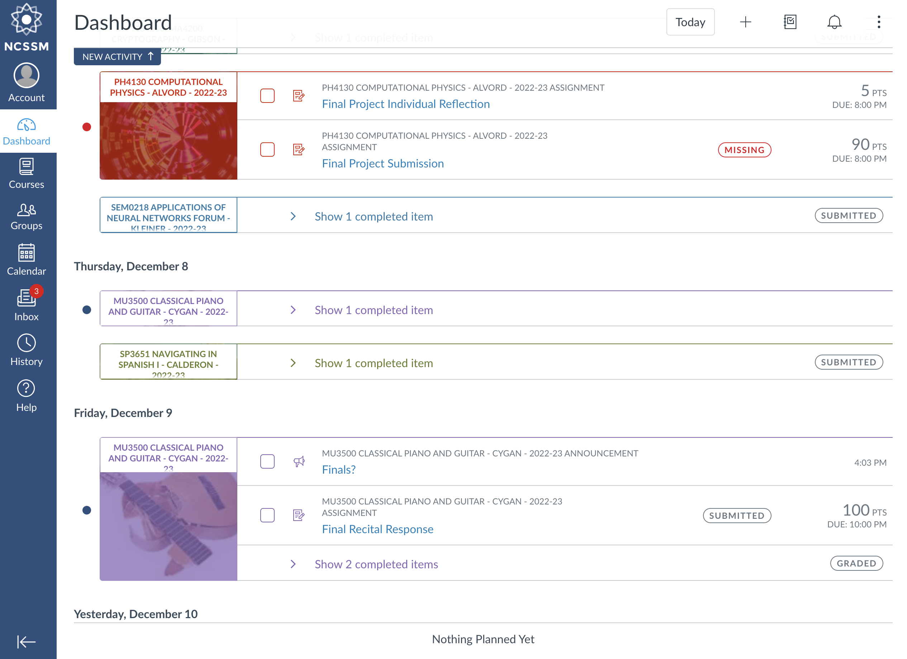
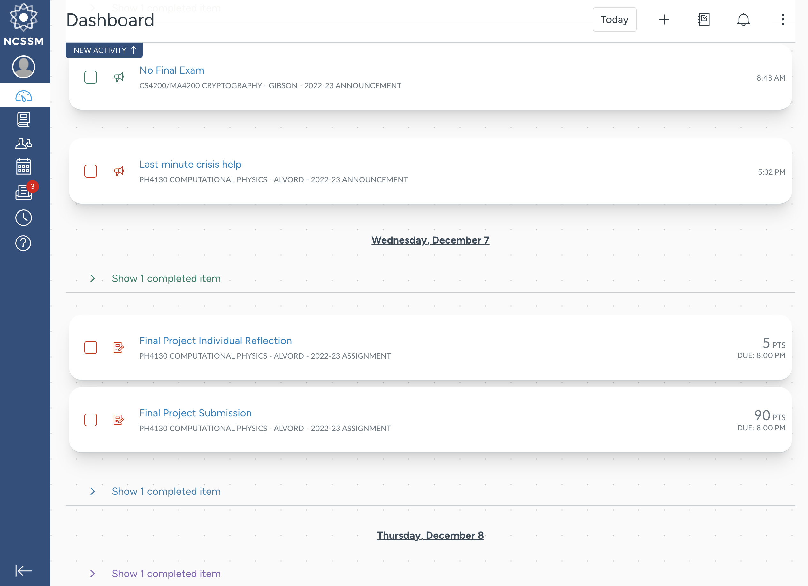
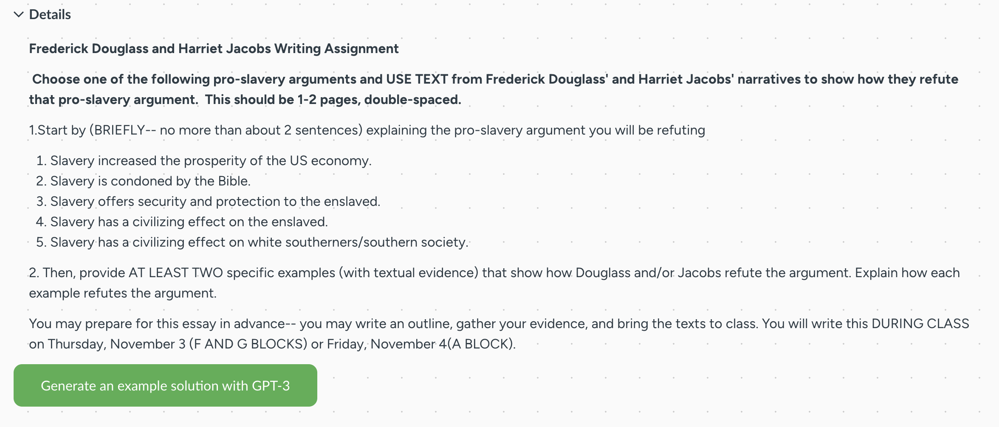
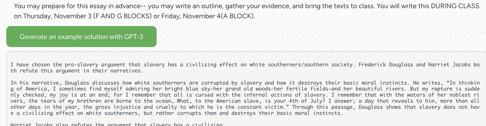

# Canvas Tweaks

## Description

Canvas is a popular learning management system (LMS) used by many schools and institutions. It provides a platform for teachers to create and manage their course content, and for students to access and submit assignments and track their progress.

This boost adds a few tweaks to the Canvas LMS to make it more usable and user-friendly, and provides a minimalistic design overhaul.

## Utility

Minimalistic Design

 
This boost allows you to simplify the design of Canvas, making it easier to focus on the content. This makes the page look more like a regular website, and less like a clunky LMS, allowing students to worry about getting their work done instead of worrying about the design of the page.

- Before: 
- After: 

GPT-3 Powered Assignment Starters

There is absolutely nothing worse than staring at a blank document with no idea what to write. With this boost, your problem is solved!

GPT-3 is a powerful technology that provides AI text/content generation. This boost provides a direct integration with OpenAI's GPT-3 API, allowing users to generate a starter for their assignments with the click of a button. This is useful for students who are struggling to come up with ideas for their assignments, and for teachers who want to provide a more personalized experience for their students.

Teachers may be concerned that this tool would be used to cheat on assignments. However, the GPT-3 prompt was formatted specially to provide just a starter/example for the assignment, and not the full assignment itself. This means that students will still have to write the majority of the assignment themselves, and will not be able to copy/paste the generated text into their assignment.

- Example: 
- Example Result: 

Assignment QR codes

Quickly open assignments on your phone to submit scanned files. This is useful for students who want to submit assignments on their phone, but don't want to type in the URL every time.

 

## Impact

Canvas is the leading learning management system in the world, with a market share of 34% and over 30 million active users. This extension will have the power to benefit many of these users, and will make Canvas a more enjoyable experience for all. One of the biggest complaints with Canvas is the lack of customization/overly utilitarian design, and this extension will address that issue.

## Creativity

This extension is unique in that it is the first of its kind. There are no other extensions that provide the same functionality, and the design tweaks are unique to this extension. The GPT-3 integration is also unique, as it utilizes cutting-edge technology in a way never seen before.
